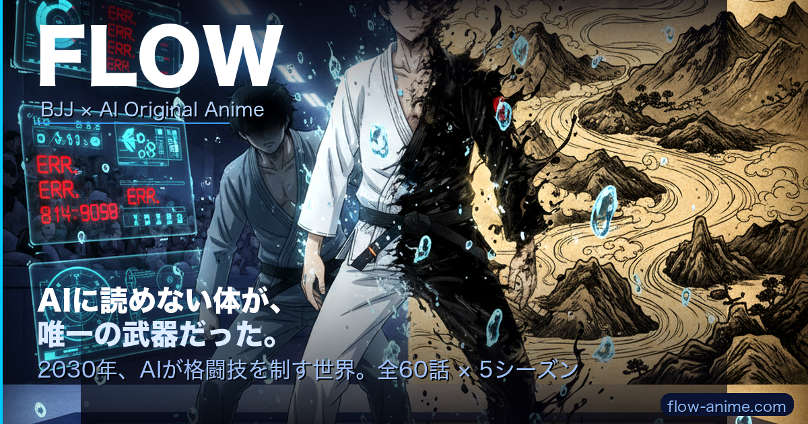
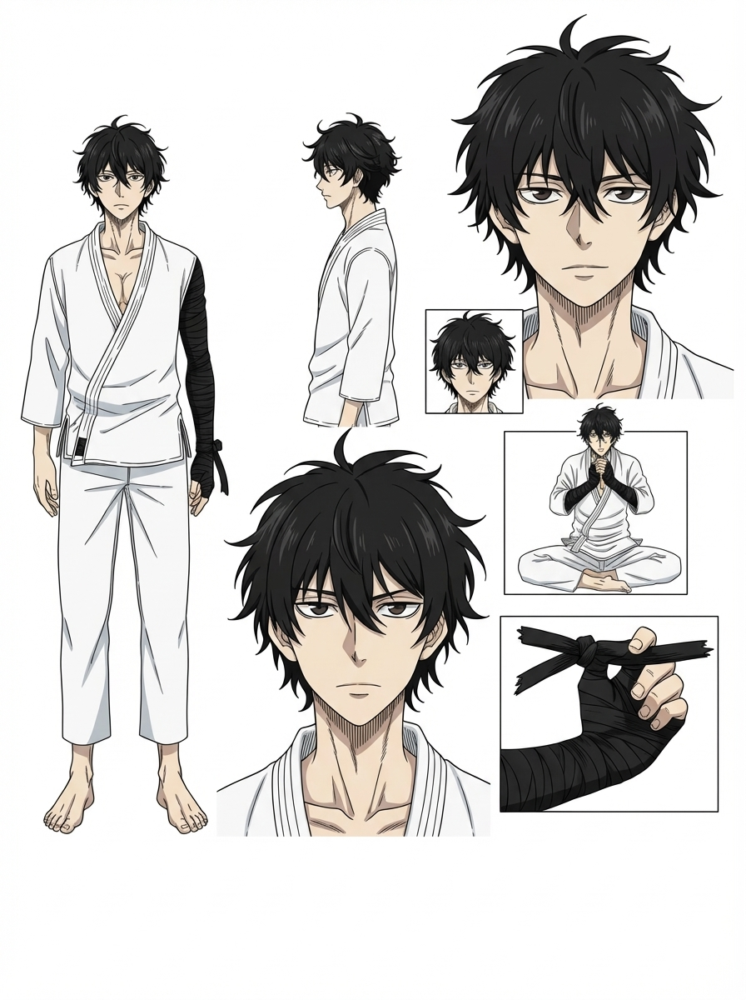
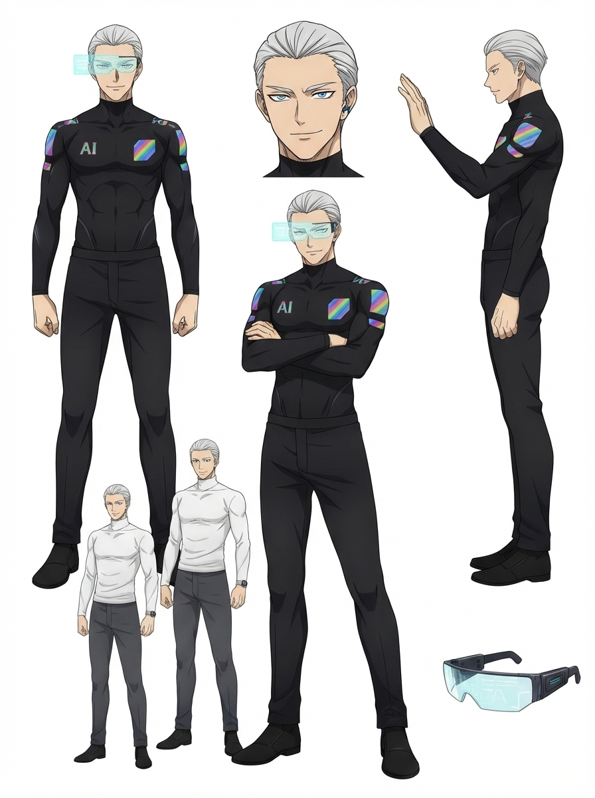
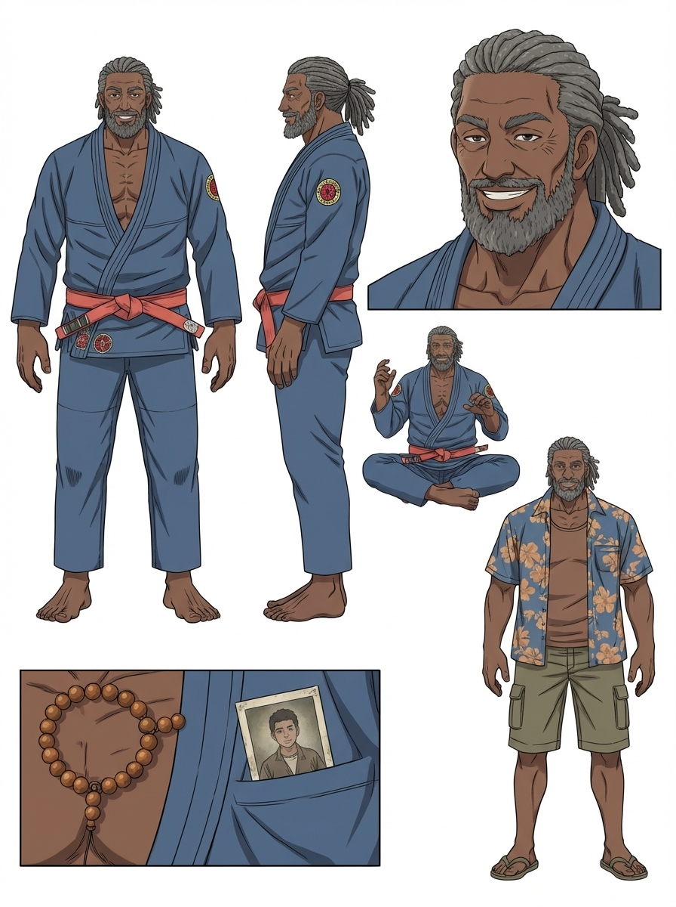
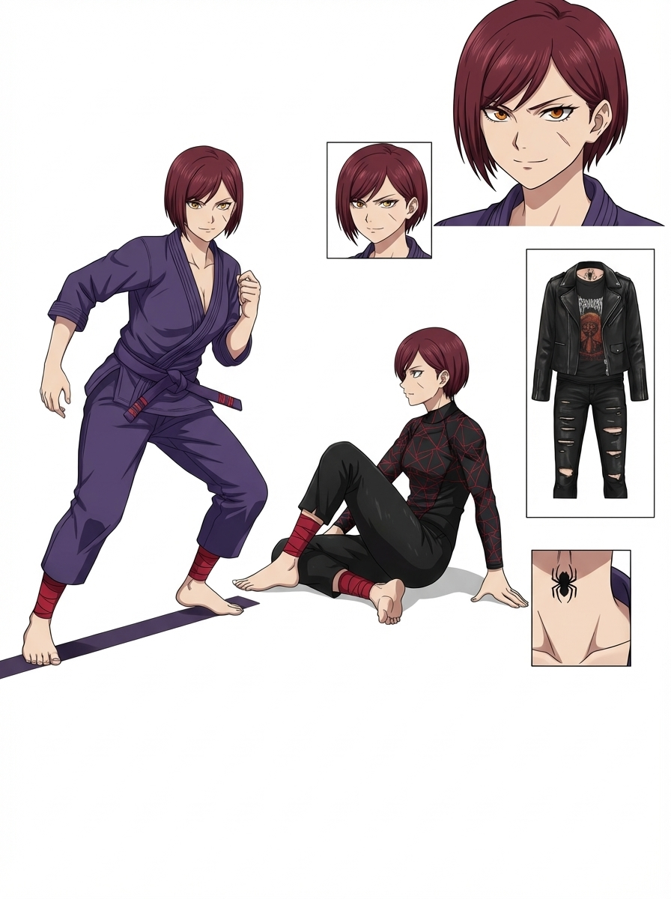
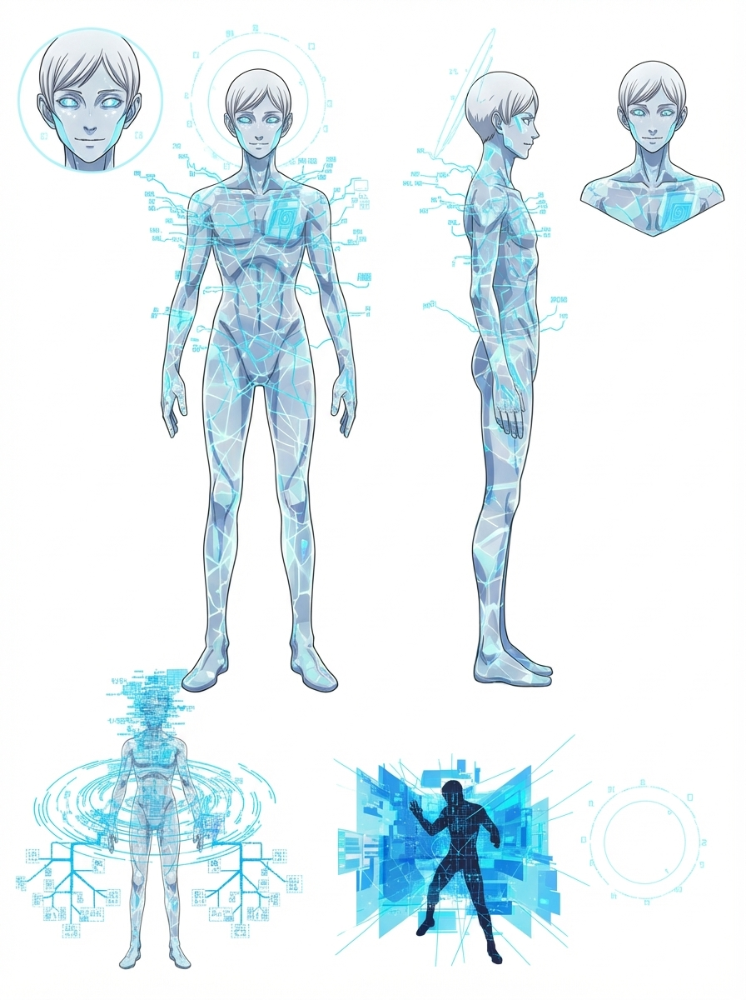

# FLOW — 柔術 x AI アニメ

**「もし柔術に、専用のアニメがあったら？」**

[flow-anime.com](https://flow-anime.com) | [@flow_bjj](https://x.com/flow_bjj) | [Opening](https://flow-anime.com/opening.html) | [Feedback](https://flow-anime.com/rpg.html)

---

## なぜ作ったか

柔術はすごい。

年齢も体格も関係ない。50歳から始めても、片腕でも、強くなれる。殴り合いじゃないから安全で、一生続けられる。道場に行けば、国籍も職業もバラバラな人たちが畳の上で笑ってる。

**この面白さを、もっと多くの人に知ってほしい。**

でも「柔術って何？」って聞かれて、言葉で説明しても伝わらない。

だったら、**アニメにすればいい。**

ワンピースが海賊を、スラムダンクがバスケを広めたように。
柔術の「あの感覚」—— エビが少しうまくなった日、初めてスイープが決まった日、先生の「もう一回」—— をアニメにしたら、世界中の人が柔術を始めるかもしれない。

今、脚本60話分、キャラクターデザイン、主題歌、世界観設定を作っています。
**みんなが見たいと思えるものに育てていきたい。** 最高の柔術アニメにしたいと思っています。

## どんな話？

> **2030年。AIが格闘技を支配する時代。**
>
> 予測精度99.8%のAI「SAGE」が全ての試合を解析する。
> 選手はAIの指示通りに動く。人間の意志は形骸化した。
>
> 左腕が壊れた17歳の少年 **流（ながれ）** は、
> AIに読めない唯一の武器 —— **"フロウ"** で世界の頂点を目指す。

全60話・5シーズン。OP「0.2%の証明」/ ED「もう一回」。全試合に実在するBJJ技名を使用。

*流 / 理央 / ルシアーノ / 凛 / SAGE*

**まずはサイトを見てみてください:** [flow-anime.com](https://flow-anime.com)

## みんなで作るアニメ

**FLOW はオープンプロジェクトです。**

脚本、キャラデザ、音楽、世界観設定 —— 全部このリポジトリにあります。
企画書じゃなくて、**生きたプロジェクト**。

「こうしたら面白くない？」があれば、どんどん取り込みたい。
面白いアイデアはみんなのものにして、一緒に育てていきましょう。

### 参加の仕方

| やりたいこと | 方法 |
|---|---|
| 感想・フィードバック | [flow-anime.com/rpg.html](https://flow-anime.com/rpg.html) から送信 |
| 技の監修 | 「この技の描写おかしいよ」 → Issue |
| ストーリー案 | 「こんな展開が見たい」 → Issue or PR |
| キャラ案 | 新キャラのアイデア → Issue |
| 音楽・イラスト | 作品を作って → PR |
| 翻訳 | 英語・ポルトガル語・その他 → PR |
| コード・サイト改善 | → PR |

貢献してくれた方はクレジットに掲載します。一緒に最高のアニメを作りましょう。

## 柔術やったことない人へ

この README を読んで少しでも気になったら、近くの道場の体験クラスに行ってみてください。

「エビ」っていう地味な動きを延々やらされます。
帰り道、全身が筋肉痛です。
でも次の日、なぜかまた行きたくなります。

先生が言います。**「もう一回」**。

## 技術的な情報

開発・デプロイ・API仕様などは [docs/TECH.md](docs/TECH.md) を参照してください。

---

**流れる水は、終わらない。**

Built with Claude Code + Gemini + Suno

---

# FLOW — BJJ x AI Anime [English]

**"What if Brazilian Jiu-Jitsu had its own anime?"**

[flow-anime.com](https://flow-anime.com) | [@flow_bjj](https://x.com/flow_bjj)

## Why we made this

BJJ is incredible. Age doesn't matter. Size doesn't matter. You can start at 50, train with one arm, and still get better every day. No striking, so it's safe. A lifetime sport. Walk into any gym and you'll find people from completely different backgrounds laughing together on the mats.

**We want more people to discover this.**

But explaining BJJ in words doesn't work. So we thought: **why not make an anime?**

One Piece made kids dream about the sea. Slam Dunk filled basketball courts across Asia. If we could capture *that feeling* — the day your shrimp got slightly better, the first time you hit a sweep, your professor's "one more time" — in an anime, maybe people all over the world would start training.

We're building this right now: 60 episodes of scripts, character designs, original soundtrack, full world-building. **We want to make this something everyone wants to watch.** The ultimate BJJ anime.

## The Story

> **2030. AI dominates fighting.**
> The AI "SAGE" analyzes every match with 99.8% accuracy. Fighters follow AI instructions. Human will is fading.
>
> **Nagare**, a 17-year-old boy with a broken left arm, fights with the only weapon AI can't predict — **"Flow."**

60 episodes. 5 seasons. Every fight uses real BJJ technique names. Original OP & ED in Japanese, English, and Portuguese.

**Check it out:** [flow-anime.com](https://flow-anime.com)

## Join Us

FLOW is an **open project**. Scripts, character designs, music, world-building — everything is in this repo.

Got an idea? Open an Issue or PR. Good ideas get folded in. Contributors get credited. Let's make the best anime together.

| Want to... | How |
|---|---|
| Give feedback | [flow-anime.com/rpg.html](https://flow-anime.com/rpg.html) |
| Fix technique accuracy | Open an Issue |
| Suggest story ideas | Issue or PR |
| Create art or music | PR |
| Translate | PR |

---

# FLOW — Jiu-Jitsu x IA Anime [Portugues]

**"E se o Jiu-Jitsu tivesse seu proprio anime?"**

[flow-anime.com](https://flow-anime.com) | [@flow_bjj](https://x.com/flow_bjj)

## Por que criamos isso

O Jiu-Jitsu e incrivel. Idade nao importa. Tamanho nao importa. Voce pode comecar aos 50, treinar com um braco so, e continuar evoluindo. Sem golpes, entao e seguro. Um esporte para a vida toda. Entre em qualquer academia e voce vai encontrar pessoas completamente diferentes rindo juntas no tatame.

**Queremos que mais pessoas descubram isso.**

Mas explicar Jiu-Jitsu com palavras nao funciona. Entao pensamos: **por que nao fazer um anime?**

One Piece fez criancas sonharem com o mar. Slam Dunk lotou quadras de basquete pela Asia. Se pudessemos capturar *aquela sensacao* — o dia que sua fuga de quadril melhorou um pouco, a primeira vez que voce acertou uma raspagem, o "mais uma vez" do Professor — em um anime, talvez pessoas do mundo todo comecassem a treinar.

Estamos construindo isso agora: 60 episodios de roteiro, design de personagens, trilha sonora original. **Queremos fazer algo que todo mundo queira assistir.** O melhor anime de Jiu-Jitsu.

## A Historia

> **2030. A IA domina as lutas.**
> A IA "SAGE" analisa cada luta com 99,8% de precisao. Lutadores seguem instrucoes da IA. A vontade humana esta desaparecendo.
>
> **Nagare**, um garoto de 17 anos com o braco esquerdo quebrado, luta com a unica arma que a IA nao consegue prever — **"Flow."**

60 episodios. 5 temporadas. Cada luta usa nomes reais de tecnicas de BJJ. OP e ED originais em japones, ingles e portugues.

**Confira:** [flow-anime.com](https://flow-anime.com)

## Participe

FLOW e um **projeto aberto**. Roteiros, designs, musica, construcao de mundo — tudo esta neste repositorio.

Tem uma ideia? Abra uma Issue ou PR. Boas ideias sao incorporadas. Contribuidores recebem credito. Vamos fazer o melhor anime juntos.

| Quer... | Como |
|---|---|
| Dar feedback | [flow-anime.com/rpg.html](https://flow-anime.com/rpg.html) |
| Corrigir tecnicas | Abra uma Issue |
| Sugerir ideias | Issue ou PR |
| Criar arte ou musica | PR |
| Traduzir | PR |

---

**A agua que flui nao tem fim.**

